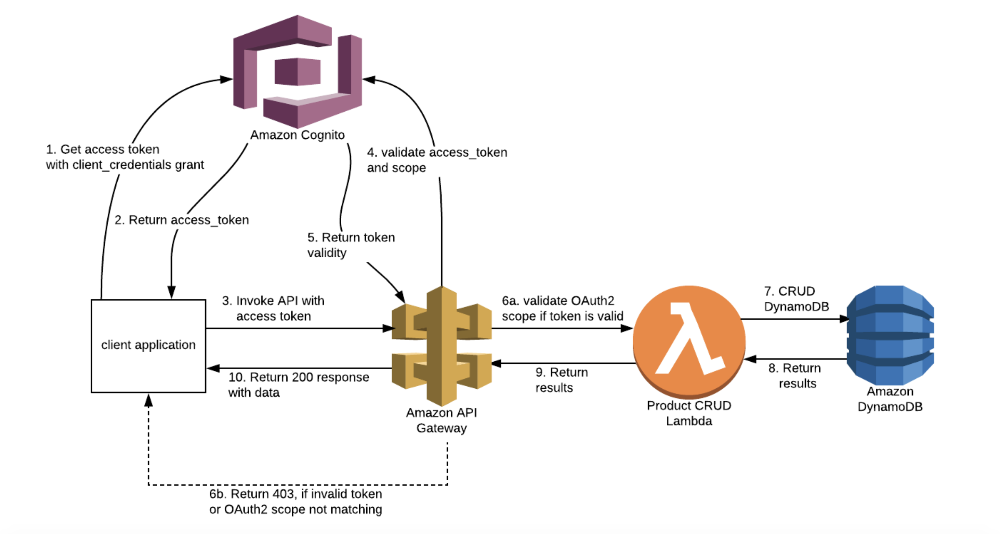

# Application diagram


# Vue App


# cognito token via api diagram



## Project setup
```
npm install
change config.js

module.exports = {
  getAllPost: 'https://up636x719d.execute-api.eu-west-2.amazonaws.com/Stage/posts',
  updatePost: 'https://up636x719d.execute-api.eu-west-2.amazonaws.com/Stage/post',
  createPost: 'https://up636x719d.execute-api.eu-west-2.amazonaws.com/Stage/post',
  deletePost: 'https://up636x719d.execute-api.eu-west-2.amazonaws.com/Stage/post',
  apiGateway: 'https://up636x719d.execute-api.eu-west-2.amazonaws.com/Stage',
  REGION: 'eu-west-2',
  USER_POOL_ID: 'eu-west-2_6o5hqtWtM',
  APP_CLIENT_ID: '31taobl5bdligosdsobsq5i7io'
}

```

### Compiles and hot-reloads for development
```
npm run serve
```

### Compiles and minifies for production
```
npm run build
```

### Lints and fixes files
```
npm run lint
```

### Customize configuration
See [Configuration Reference](https://cli.vuejs.org/config/).
